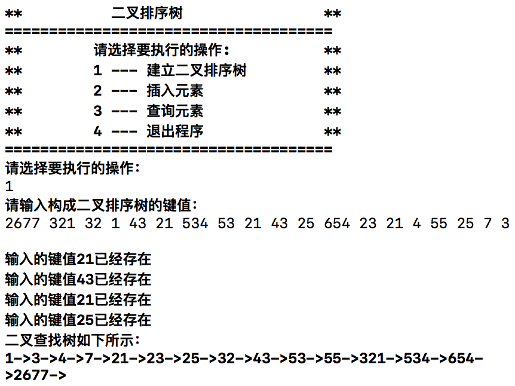
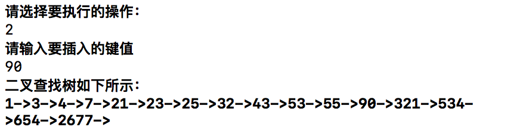
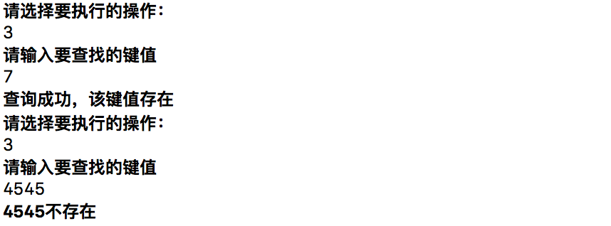
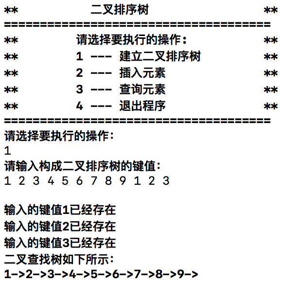
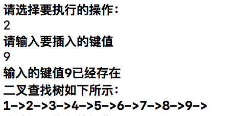
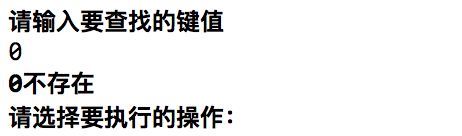

# 数据结构课程设计 项目说明文档

>  #### 二叉排序树
>
>  李坤
>
>  1553321


1. **项目介绍**

   - 二叉排序树就是指将原来已有的数据根据大小构成一棵二叉树，二叉树中的所有结点数据满足一定的大小关系，所有的左子树中的结点均比根结点小，所有的右子树的结点均比根结点大。

   - 二叉排序树查找是指按照二叉排序树中结点的关系进行查找，查找关键字首先同根结点进行比较，如果相等则查找成功；如果比根节点小，则在左子树中查找；如果比根结点大，则在右子树中进行查找。这种查找方法可以快速缩小查找范围，大大减少查找关键的比较次数，从而提高查找的效率。

     ​

2. **整体描述**

   - 本项目是对二叉排序树的实现，用控制台选项的选择方式完成下列功能：建立二叉排序树；插入元素；查询元素；退出系统。

   - 运行环境：

     exe可执行文件：带有图形驱动的windows平台

     经过测试，源码也可在Unix平台（如MacOS）上正常编译并运行

   - 代码托管平台：Github

     ​

3. **系统设计**

   - **数据结构**：根据考提高查找效率的功能需求，需要快速缩小查找范围，大大减少查找的比较次数。根据实际功能需求，本系统采用二叉树来存储数据，将原来已有的数据根据大小构成一棵二叉树，二叉树中的所有结点数据满足一定的大小关系，所有的左子树中的结点均比根结点小，所有的右子树的结点均比根结点大。

   - **类设计**：

     - **节点类说明**：

       **功能**：该类用于存储基本的节点信息，包括指向其左右子树的指针和其节点本身所存储的数字信息。

       **详细描述**：

       | 成员           | 访问权限    | 详细描述     |
       | ------------ | ------- | -------- |
       | Node* _left  | private | 指向左子树的指针 |
       | Node* _right | private | 指向右子树的指针 |
       | int _number  | private | 节点代表的值   |

       | 方法               | 访问权限   | 详细描述           |
       | ---------------- | ------ | -------------- |
       | Node()           | public | 构造函数           |
       | void addLeft()   | public | 为该节点添加指向左子树的指针 |
       | void addRight()  | public | 为该节点添加指向右子树的指针 |
       | Node* getLeft)   | public | 获取指向左子树的指针     |
       | Node* getRight() | public | 获取指向右子树的指针     |
       | int value()      | public | 获取该节点的值        |

     - **二叉树类说明**：

       | 成员          | 访问权限    | 详细描述     |
       | ----------- | ------- | -------- |
       | Node *_root | private | 指向链表的根节点 |

       | 方法                 | 访问权限   | 详细描述                    |
       | ------------------ | ------ | ----------------------- |
       | Tree()             | public | 构造函数                    |
       | void show()        | public | 按从小到大的顺序展示排序结果          |
       | Node *startPoint() | public | 返回指向根节点的指针              |
       | bool insert()      | public | 插入一个新节点，如果失败的话返回`false` |
       | Node *find()       | public | 寻找某个节点，失败的话返回空指针        |


4. **具体实现**

   - **建立二叉排序树功能**：

     - 在初始化时将二叉排序树的根节点设为空指针，同时先将所有输入的数字读入`string`，构造一个输入流`in_string`，将其中的数字逐个读出。每读入一个数字，就调用`insert`方法将其插入二叉树中。

       ```c++
           Tree(){
               _root = nullptr;
               cout << "请输入构成二叉排序树的键值：" << endl;
               string in_string;
               stringstream stream;
               getline(cin, in_string);
               stream << in_string;
               int temp = 0;
               cout << endl;
               while (stream >> temp) {
                   insert(temp);
               }
           }
       ```

     - 运行示例

       

   - **插入功能**：

     - 当根节点为空指针时，插入的元素作为根节点。当非空时，首先执行一次查找操作，当发现二叉排序树中已存在该值时，给出错误提示。当不存在时，依据查找到的父亲节点决定是将其分配到其左叶子节点还是右叶子节点。

       ```c++
           bool insert(int n){
               if(_root == nullptr){
                   _root = new Node(n);
                   if (_root == nullptr) {
                       cerr << "内存分配错误" << endl;
                       return false;
                   }
               }else{
                   Node *temp = find(n, _root);
                   if (temp == nullptr) {
                       cout << "输入的键值" << n << "已经存在" << endl;
                   }else{
                       Node *new_node = new Node(n);
                       if (new_node == nullptr) {
                           cerr << "内存分配错误" << endl;
                           return false;
                       }
                       temp->value() < n? temp->addRight(new_node) : temp->addLeft(new_node);
                   }
               }
               return true;
           }
       ```

     - 运行示例

       

   - **查找功能** 

     - 当查找成功时，返回空指针。当查找失败时，返回插入该元素时的其应指向的父节点。

       ```c++
           Node *find(int n, Node *current){
               if (current->value() == n) {
                   return nullptr;
               }else{
                   if(current->value() < n){
                       if (current->getRight() == nullptr) {
                           return current;
                       }else{
                           return find(n, current->getRight());
                       }
                   }
                   else{
                       if (current->getLeft() == nullptr) {
                           return current;
                       }else{
                           return find(n, current->getLeft());
                       }
                   }
               }
           }
       ```

     - 运行示例

       

5. **鲁棒性测试**

   1. 初始化系统时输入的元素有重复的

      - 测试用例：初始化系统时向系统中输入的一串数字中存在重复元素

      - 预期结果：操作之后系统只保留一个重复的元素，并给出键值重复的提示，各个功能能正常运行，系统不崩溃。

      - 测试结果：

        

   2. 插入元素时输入的元素已经存在于二叉排序树中

      - 测试用例：插入元素时向系统中输入已经存在于二叉排序树中的元素

      - 预期结果：操作之后系统只保留一个重复的元素，并给出键值重复的提示，各个功能能正常运行，系统不崩溃。

      - 测试结果：

        

   3. 查找元素时输入的元素不存在于二叉排序树中

      - 测试用例：插入元素时向系统中输入不存在于二叉排序树中的元素

      - 预期结果：操作之后系统给出键值不存在的提示，各个功能能正常运行，系统不崩溃。

      - 测试结果：

        

