# 数据结构课程设计 项目说明文档

>  #### N皇后问题
>
>  李坤
>
>  1553321


1. **项目介绍**

   - 冒泡排序、选择排序、直接插入排序、希尔排序、快速排序、堆排序、归并排序、基数排序是常见

   - 随机函数产生10000个随机数，用快速排序，直接插入排序，冒泡排序，选择排序的排序方法排序，并统计每种排序所花费的排序时间和交换次数。其中，随机数的个数由用户定义，系统产生随机书。并且显示他们的比较次数。

     ​

2. **整体描述**

   - 本项目是对N皇后求解问题的简单模拟，同时通过添加一些辅助数组来优化算法，达到以空间换时间的目的。用控制台选项的选择方式完成下列功能：输入皇后的个数并求解所有可能的摆法。

   - 八皇后在棋盘上分布的各种可能的格局数目非常大，约等于2的32次方种，但是，可以将一些明显不满足问题要求的格局排除掉。由于任意两个皇后不能同行，即每行只能放置一个皇后，因此将第i个皇后放在第i航上，这样在放置第i个皇后时，只要考虑它与前i-1个皇后处于不同列和不同对角线位置上即可。

   - 运行环境：

     exe可执行文件：带有图形驱动的windows平台

     经过测试，源码也可在Unix平台（如MacOS）上正常编译并运行

   - 代码托管平台：Github

     ​

3. **系统设计**

   - **算法**：根据需要打印出所有可能解法的功能需求，本项目采用回溯法，一层一层尝试添加皇后，当得出一个解时便回溯到上一层，继续从下一个位置开始递归求解。

   - **优化**

     设计三个辅助数组：列方向、左斜线方向、右斜线方向的标记数组，来判断皇后位置是否合法，通过空间换时间，以达到优化算法运行速度的目的。

4. **具体实现**

   - 初始化保存皇后位置的数组和三个辅助数组，分别用来判断皇后在列方向和对角线方向是否合法

     ```c++
         int* q = new int[n]();      //第n个皇后所在的列坐标
         int* v = new int[n]();      //辅助数组，用来标记第i列是否有已经有皇后占用
         int* l = new int[2 * n]();  //辅助数组，用来标记第i条左斜线是否已经有皇后占用
         int* r = new int[2 * n]();  //辅助数组，用来标记第i条右斜线是否已经有皇后占用
         
         recall(0, n, q, v, l, r);
     ```

   -  当已经递归到第n+1行时，即前面的n个皇后都已经填入适当的位置了，此时得到一个正确的解，将解输出

     ```c++
     //当找到第n+1行时，表明前n个皇后已经填入n行中，得到一个解并打印
         if (layer == n) {
             printResult(q, n);
             return;
         }
     ```

   -  当还未求出n个皇后位置的解时，依次尝试将第`layer`个皇后放入行中的所有位置，并检查其位置是否合法。如果合法，则保存位置，递归重复上述操作。当递归完毕进行回溯时，将保存的位置抹去，取消对当前行的改变，继续从下一个位置开始尝试放入皇后并递归求解。

     ```c++
         for (int i = 0; i < n; i++) {
             //判断第layer行第i个位置在列、左斜线、右斜线三个方向是否合法
             if (v[i] == 0 && l[layer + i] == 0 && r[n + i - layer] == 0) {
                 q[layer] = i;
                 l[layer + i] = 1;
                 v[i] = 1;
                 r[n + i - layer] = 1;
                 //在该行放下一个皇后之后，递归调用寻找下一个皇后的位置
                 recall(layer+1, n, q, v, l, r);
                 //回溯，抹掉之前的改变
                 q[layer] = 0;
                 v[i] = 0;
                 l[layer + i] = 0;
                 r[n + i - layer] = 0;
             }
         }
     ```

5. **运行示例**

   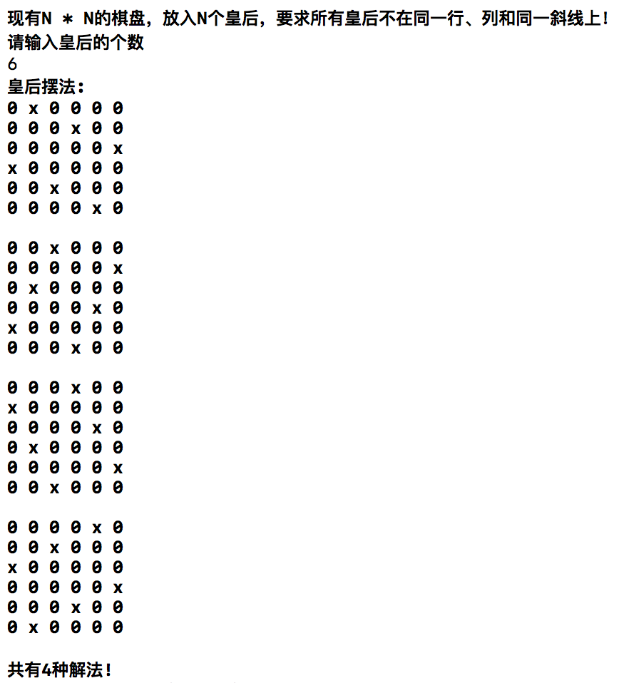


6. **算法正确性检验**

   1. 从1到10，检查算法是否能输出正确的结果

      - 测试用例：向系统中分别输入1～10，检查算法是否能正确输出结果

      - 预期结果：操作之后算法能正确输出结果，程序正常运行不崩溃。

      - 测试结果：

        - 1

          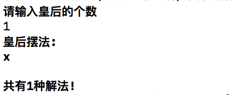

        - 2

          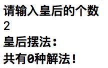

        - 3

          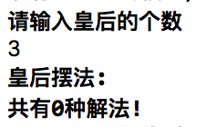

        - 4

          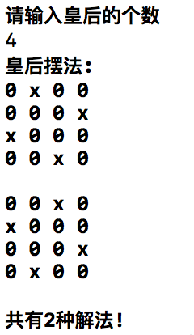

        - 5

          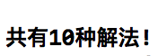

        - 6

          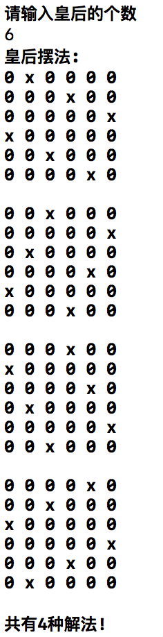

        - 7

          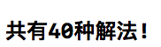

        - 8

          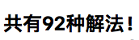

        - 9

          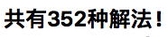

        - 10

          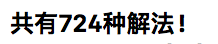

   2. 初始化时输入非法操作数

      - 测试用例：初始化时向系统中输入负数或0

      - 预期结果：程序给出输入错误的提示并正常退出，运行期间不崩溃

      - 测试结果：

        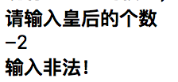

        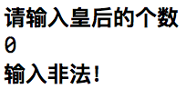