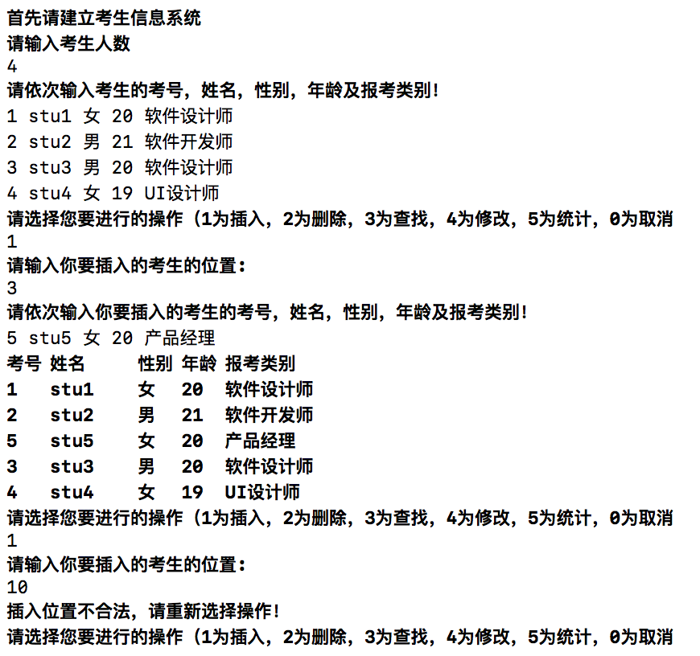
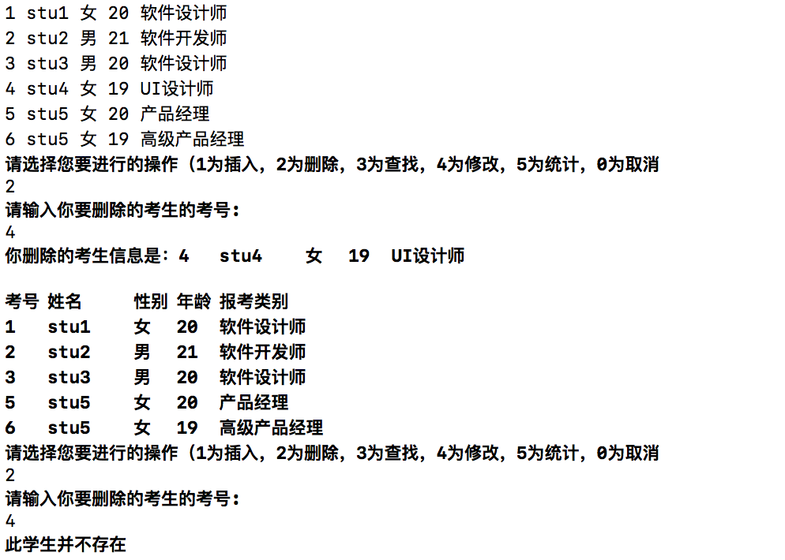
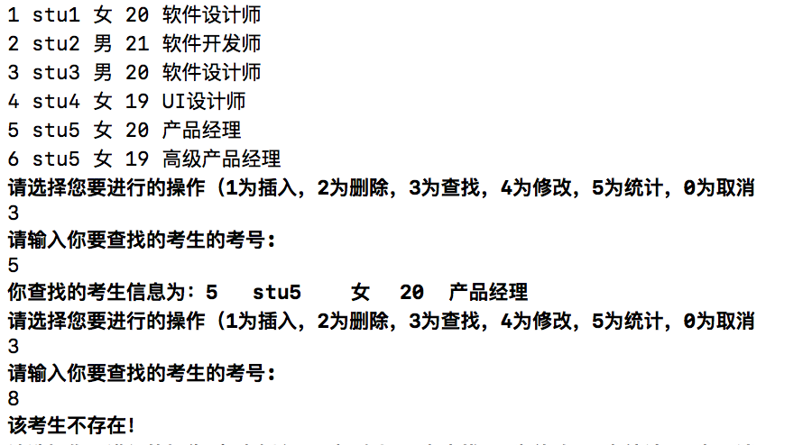
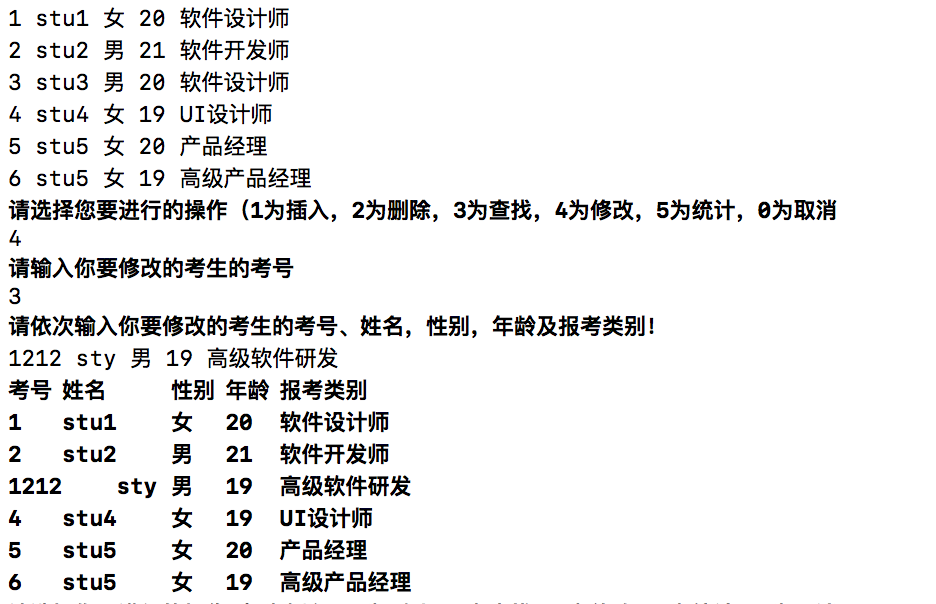
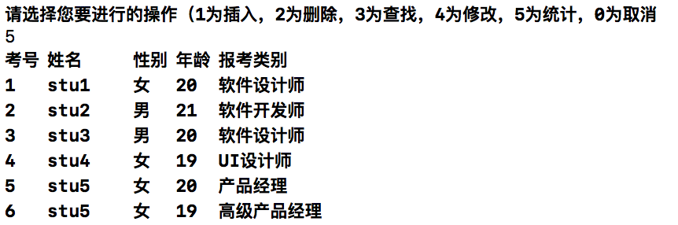

# 数据结构课程设计 项目说明文档

>  #### 考试报名系统
>
>  李坤
>
>  1553321


1. **项目介绍**

   - 考试报名系统是一个学校不可缺少的部分，它对于学校的管理者和学生来说都至关重要，所以一个良好的考试报名系统应该能够为用户提供充足的信息和功能。考试报名系统对于学校加强考试管理有极其重要的作用。随着学生数量和考试数量的日益庞大，如何管理如此庞大的数据显得极为复杂，传统的手工管理工作量大且容易出错。

   - 随着计算机科学技术的不断成熟，使用计算机对考试报名系统进行管理，具有手工管理所无法比拟的优势。这些优点能够极大地提高学校和学生的效率，也是学校走向信息化、科学化、国际化的重要条件。因此，开发一套考试报名系统具有十分重要的意义。

     ​

2. **整体描述**

   - 本项目是对考试报名管理的简单模拟，用控制台选项的选择方式完成下列功能：输入考生信息；输出考生信息；查询考生信息；添加考生信息；修改考生信息；删除考生信息；退出系统。

   - 运行环境：

     exe可执行文件：带有图形驱动的windows平台

     经过测试，源码也可在Unix平台（如MacOS）上正常编译并运行

   - 代码托管平台：Github

     ​

3. **系统设计**

   - **数据结构**：根据考试报名系统的功能需求，需要大量的添加和删除操作，同时数据大小预先并不知道，要根据实际需求动态调整。根据实际功能需求，本系统采用链表来存储数据。基于DRY(Don't repeat yourself)原则，本系统为了简化实现，在第一个节点前附加一个头节点，方便操作，避免代码重复，使操作得到简化。

   - **类设计**：

     - **节点类说明**：

       **功能**：该类用于存储考生的基本信息，根据输入的信息对单个考生的基本信息进行添加和修改。

       **详细描述**：

       | 成员                      | 访问权限      | 详细描述          |
       | ----------------------- | --------- | ------------- |
       | int _examId             | protected | 考生考号          |
       | int _age                | protected | 考生年龄          |
       | string _name            | protected | 考生姓名          |
       | string _gender          | protected | 考生性别          |
       | string _examSubject     | protected | 考试科目          |
       | InformationNode * _next | protected | 指向下一个节点类对象的指针 |

       | 方法                       | 访问权限   | 详细描述             |
       | ------------------------ | ------ | ---------------- |
       | InformationNode()        | public | 构造函数             |
       | InformationNode * next() | public | 返回该节点指向的下一个节点的指针 |
       | void setAsEnd()          | public | 将该节点设置为链表末尾      |
       | void changeNext()        | public | 改变该节点指向下一个节点的指针  |
       | string getName()         | public | 获取该节点中考生的姓名      |
       | void changeName()        | public | 改变该节点中考生的姓名      |
       | string getGender()       | public | 获取该节点中考生的性别      |
       | void changeExamSubject() | public | 改变该节点中考生的考试科目    |
       | int getExamId()          | public | 获取该节点中考生的考号      |

     - **链表类说明**：

       | 成员                       | 访问权限      | 详细描述            |
       | ------------------------ | --------- | --------------- |
       | InformationNode * _start | protected | 指向链表的第一个节点      |
       | InformationNode * _end   | protected | 指向链表的最后一个节点     |
       | InformationNode * _init  | protected | 指向链表的附加头节点      |
       | int _totalNumber         | protected | 链表中不包括附加节点的节点数量 |

       | 方法                              | 访问权限   | 详细描述              |
       | ------------------------------- | ------ | ----------------- |
       | List()                          | public | 构造函数              |
       | ~List()                         | public | 析构函数              |
       | InformationNode * findStudent() | public | 根据考号寻找考生，失败时返回空指针 |
       | InformationNode * insert()      | public | 插入考生              |
       | InformationNode * modify()      | public | 修改考生信息            |
       | void deleteNode()               | public | 根据考号删除考生          |
       | void show()                     | public | 展示系统内现有考生的所有信息    |
       | void printNode()                | public | 根据输入的考号展示该考生的信息   |


4. **具体实现**

   - **插入功能**：

     - 插入功能核心代码

       ```c++
           //创建新节点
           InformationNode * temp = new InformationNode(id, age, name, gender, subject);
           if(temp == nullptr){
               cerr << "内存分配错误" << endl;
               return nullptr;
           }
           //寻找前一个节点
           InformationNode *current = _start;
           InformationNode * before = nullptr;
           int count = 1;
           while (count != position) {
               count ++;
               before = current;
               current = current->next();
           }
           //插入新节点
           _end->changeNext(temp);
           _end = temp;
           _end->setAsEnd();
           _start->changeNext(temp);
           _start = temp;
       ```

     - 插入功能运行示例

       

   - **删除功能**：

     - 删除功能核心代码

       ```c++
           //找到要删除的节点
           InformationNode* target = this->findStudent(ex_id);
           if(target == nullptr){
               cerr << "此学生并不存在" << endl;
               return;
           }
           InformationNode *current = _start;
           //找到该节点的前驱
           while (current->next() != target) {
               current = current->next();
           }
           
           if(target == _end){
               current->setAsEnd();
           }else{
               current->changeNext(target->next());
           }
           //展示信息并删除节点
           cout << "你删除的考生信息是：";
           printNode(target);
           cout << endl;
           delete target;
           _totalNumber--;
           this->show();
       ```

     - 删除功能运行示例

       

   - **查找功能** 

     - 查找功能核心代码

       ```c++
           //查看系统是否为空
           InformationNode *current = _start;
           if(_start == _init){
               cerr << "系统为空 !!!" << endl;
               return nullptr;
           }
           //进行查找
           while (current->next() != nullptr) {
               if(current->getExamId() == ex_id){
                   return current;
               }else{
                   current = current->next();
               }
           }
           //查找成功则返回指向该考生节点的指针
           if(current->getExamId() == ex_id){
               return current;
           }else{
               current = current->next();
           }
           //查找失败则返回空指针
           return nullptr;
       ```

     - 查找功能运行示例

       

   - **修改功能**

     - 修改功能核心代码

       ```c++
           //根据考号查找考生
           InformationNode* target = this->findStudent(id);
           if(target == nullptr){
               cerr << "此学生并不存在" << endl;
               return nullptr;
           }
           
           std::cout << "请依次输入你要修改的考生的考号、姓名，性别，年龄及报考类别！" << endl;
           string name, gender, subject;
           int age,new_id;
           cin >> new_id >> name >> gender >> age >> subject;
           //修改该考生的各项信息
           target->changeExamId(new_id);
           target->changeName(name);
           target->changeGender(gender);
           target->changeAge(age);
           target->changeExamSubject(subject);
       ```

     - 修改功能运行示例

       

   - **统计功能**

     - 统计功能核心代码

       ```c++
           //判断系统是否为空
           if(_start == _init){
               cerr << "系统中不存在任何考生信息" << endl;
               return;
           }
           //打印标题行
           InformationNode * current = _start;
           cout << "考号"<< '\t'<< "姓名" << "\t\t"<< "性别" << '\t' << "年龄" << '\t' << "报考类别" << endl;
           //逐个打印系统中的考生信息
           while (current->next() != nullptr) {
               printNode(current);
               current = current ->next();
           }
           printNode(current);
       ```

     - 统计功能运行示例

       

5. **鲁棒性测试**

   - **边界测试**

     1. 不正常初始化
        - 测试用例：初始化系统时不向系统中输入任何考生信息。
        - 预期结果：操作之后仍能正常向系统中插入考生信息，同时删除、修改、查找、统计功能能正常运行并提示用户系统为空，系统正常运行不崩溃。
        - 测试结果：

       2. 删除头节点
         - 测试用例：删除系统中第一个考生
         - 预期结果：操作之后系统中插入、删除、修改、查找、统计功能能正常运行，系统不崩溃。
         - 测试结果：
       3. 删除尾节点
         - 测试用例：删除系统中末尾的考生
         - 预期结果：操作之后系统中插入、删除、修改、查找、统计功能能正常运行，系统不崩溃。
         - 测试结果：
       4. 删除后系统为空
         - 测试用例：删除系统所有的考生
         - 预期结果：操作之后仍能正常向系统中插入考生信息，同时删除、修改、查找、统计功能能正常运行并提示用户系统为空，系统正常运行不崩溃。
         - 测试结果：

   - **非法输入测试**

     1. 初始化系统时输入的考生人数为负数
        - 测试用例：初始化系统时向系统中输入负数
        - 预期结果：操作之后系统为空，插入、删除、修改、查找、统计功能能正常运行，系统不崩溃。
        - 测试结果：
     2. 插入、删除、查找、修改时输入错误的位置或考号
        - 测试用例：执行插入、删除、查找、修改操作时输入错误的位置或考号
        - 预期结果：系统给出错误提示，操作后系统插入、删除、修改、查找、统计功能能正常运行，系统不崩溃。
        - 测试结果：
     3. 输入错误的操作数
        - 测试用例：向系统输入不存在的操作码
        - 预期结果：系统给出错误提示，操作后系统插入、删除、修改、查找、统计功能能正常运行，系统不崩溃。
        - 测试结果：


​