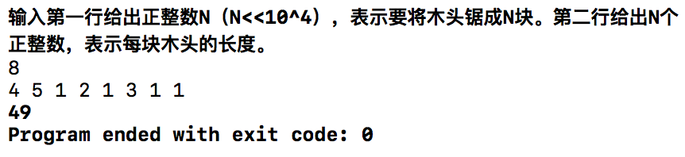

# 数据结构课程设计 项目说明文档

>  #### 修理牧场
>
>  李坤
>
>  1553321


1. **项目介绍**

   - 农夫要修理牧场的一段栅栏，他测量了栅栏，发现需要N块木头，每块木头长度为整数*Li*个长度单位，于是他购买了一个很长的，能锯成N块的木头，即该木头的长度是*Li*的总和。
   - 农夫自己没有锯子，请人锯木的酬金跟这段木头的长度成正比。为简单起见，不妨就设酬金等于所锯木头的长度。例如，要将长度为20的木头锯成长度为8，7和5的三段，第一次锯木头将木头锯成12和8，花费20；第二次锯木头将长度为12的木头锯成7和5花费12，总花费32元。如果第一次将木头锯成15和5，则第二次将木头锯成7和8，那么总的花费是35（大于32）.

2. **整体描述**

   - 本项目为对修理牧场问题的求解，使用控制台输入基本参数使程序自动求解。

   - 输入要求：

     - 输入格式：输入第一行给出正整数N（N<<10^4），表示要将木头锯成N块。第二行给出N个正整数，表示每块木头的长度。
     - 输出格式：输出一个整数，即将木头锯成N块的最小花费。

   - 运行环境：

     exe可执行文件：带有图形驱动的windows平台

     经过测试，源码也可在Unix平台（如MacOS）上正常编译并运行

   - 代码托管平台：Github

     ​

3. **算法设计**

   - 根据题目要求可知，酬金等于所锯木头的长度，在锯木头总次数相等的情况下，尽量避免对长度较长的木块进行多次操作。也就是说，面对一块木头时，尽量对半将其锯开，减少每次操作后的平均木块长度，而不是分成一大一小两个部分锯开，对以后的拆分会更有利。
   - 从正向来看，最终得到的N块木头是经过每次近乎对半锯开后得到的，从反向来看，成品木块中的最小块组成了次小块，长度越短的木块经历的切割次数越多，长度越长的木块经历的切割次数越少。
   - 锯木头的过程可以看作是构造哈夫曼树的过程，使权值越大的叶子结点越靠近根结点，而权值越小的叶子越远离根结点。


4. **具体实现**

   本程序采用优先队列来以哈夫曼树的思想解决锯木头问题。

   - 采用优先队列来存储每个木块的权值，使用c++ stl 模板优先队列 `priority_queue`，存储容器为`vector<int>`，使用`greater<int>`模板使优先队列以最小值优先。

   ```c++
       //建立优先队列，存储容器为vector<int>，最小值优先
       priority_queue<int, vector<int>, greater<int> > wood;
   ```

   - 从控制台输入将每段木材的长度读入优先队列中

   ```c++
       //将每段木材的长度读入优先队列中
       for (int i = 0; i < n; i++) {
           int temp;
           cin >> temp;
           wood.push(temp);
       }
   ```

   - 找到当前所有木材中长度最短（权值最小）的两根，从优先队列中取出，计算其和，并将合并长度后的木材放入队列（将子树的带权路径长度作为新的节点权值），直至优先队列里只有一个元素，哈夫曼树的带权路径总长度可知。

   ```c++
       while (wood.size()!= 1) {
           //读出所需要木材长度中最短的两根
           int first = wood.top();
           wood.pop();
           int second = wood.top();
           wood.pop();
           //将这两根木材合并，作为一根新木材放入队列中，将两根木材的花销加入总花销内
           count += (first + second);
           wood.push(first + second);
       }
   ```

5. **运行示例**

   

