# 数据结构课程设计 项目说明文档

>  #### 家谱管理系统
>
>  李坤
>
>  1553321


1. **项目介绍**

   - 家谱是一种以表谱形式，记载一个以血缘关系为主体的家族世袭繁衍和重要任务事迹的特殊图书体裁。家谱是中国特有的文化遗产，是中华民族的三大文献（国史，地志，族谱）之一，属于珍贵的人文资料，对于历史学，民俗学，人口学，社会学和经济学的深入研究，均有其不可替代的独特功能。本项目兑对家谱管理进行简单的模拟，以实现查看祖先和子孙个人信息，插入家族成员，删除家族成员的功能。
   - 随着计算机科学技术的不断成熟，使用计算机对家谱体系进行管理，具有手工管理所无法比拟的优势。这些优点能够极大地家谱查找和维护的效率，具有十分重要的意义。

2. **整体描述**

   - 本项目的实质是完成对家谱成员信息的建立，查找，插入，修改，删除等功能，可以首先定义家族成员数据结构，然后将每个功能作为一个成员函数来完成对数据的操作，最后完成主函数以验证各个函数功能并得到运行结果。

   - 运行环境：

     exe可执行文件：带有图形驱动的windows平台

     经过测试，源码也可在Unix平台（如MacOS）上正常编译并运行

   - 代码托管平台：Github

     ​

3. **系统设计**

   - **数据结构**：根据家谱管理系统的功能需求和家谱数据的特殊树状结构，需要大量的添加和删除操作，同时分支数目不确定，数据大小预先并不知道，要根据实际需求动态调整。根据实际功能需求，本系统采用多叉树来存储数据。

   - **类设计**：

     - **节点类说明**：

       **功能**：该类用于存放家谱成员的基本信息，根据输入的信息对单个考生的基本信息进行添加和修改。

       **详细描述**：

       | 成员                       | 访问权限   | 详细描述            |
       | ------------------------ | ------ | --------------- |
       | string _name             | public | 家谱成员的姓名         |
       | Node * _elder            | public | 指向家谱成员直系长辈的指针   |
       | vector<Node*> _offspring | public | 存放指向该家谱成员的子辈的指针 |

       | 方法                                       | 访问权限   | 详细描述 |
       | ---------------------------------------- | ------ | ---- |
       | Node(string name, Node * elder_generation) | public | 构造函数 |

     - **树类说明**：

       **功能**：该类用于构造用于储存家谱信息的多叉树，根据需要更新家谱信息、查找亲属、增加关系、删除关系

       **详细描述**：

       | 成员                | 访问权限    | 详细描述              |
       | ----------------- | ------- | ----------------- |
       | int _total_number | private | 家谱里现有成员的数量        |
       | Node * _ancestor  | private | 指向家谱树的根，即所有人的共同祖先 |

       | 方法                    | 访问权限   | 详细描述                |
       | --------------------- | ------ | ------------------- |
       | Tree(void)            | public | 构造函数                |
       | ~Tree(void)           | public | 析构函数                |
       | bool checkOk()        | public | 查看每次为家谱成员分配内存空间是否成功 |
       | Node * find()         | public | 根据名字查找某位家谱成员        |
       | void printChild()     | public | 打印某位家谱成员的所有子代       |
       | void dissolve()       | public | 解散某个家庭              |
       | bool addNewMember()   | public | 添加新的家庭成员            |
       | bool newFamily()      | public | 建立新的家庭              |
       | void dissolveFamily() | public | 解散某个家庭              |


4. **具体实现**

   - **完善家谱功能**：

     - 完善家谱功能流程图

     - 完善家谱功能核心代码

       ```c++
               //根据输入的名字查找家庭的建立者
               Node *parent = find(name, _ancestor);
               if (parent == nullptr) {
                   cout << "此人不存在～" << endl;
                   return false;
               }
               cout << "请输入" << parent->_name << "的儿女人数: " << endl;
               int number;
               cin >> number;
               cout << "请依次输入" << parent->_name <<"的儿女的姓名: " << endl;
               vector<string> name_list;
               for (int i = 0; i < number; i++) {
                   string temp;
                   cin >> temp;
                   name_list.push_back(temp);
               }
               for (int i = 0; i < number; i++) {
                   Node * _child = new Node(name_list[i], parent);
                   if(checkOk(_child)){
                       parent->_offspring.push_back(_child);
                   }
               }
               printChild(parent);
       ```

     - 完善家谱功能运行示例

       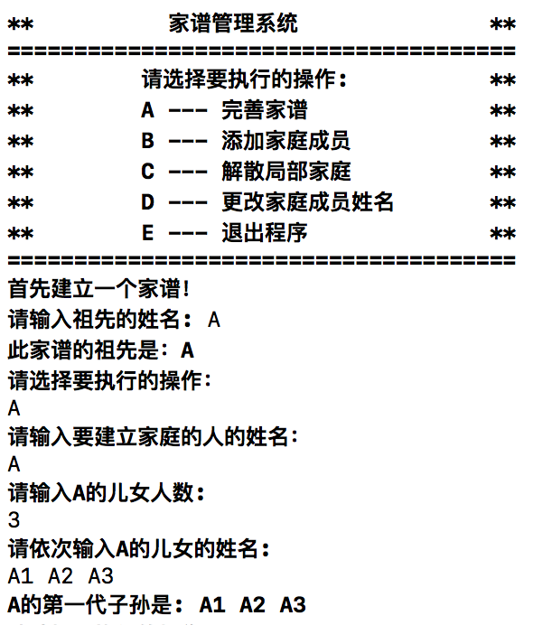

   - **添加家庭成员功能**：

     - 添加家庭成员流程图

     - 添加家庭成员功能核心代码

       ```c++
           //添加新的家庭成员
           bool addNewMember(void){
               cout << "请输入要添加儿子（或）女儿的人的姓名：" << endl;
               string name;
               cin >> name;
               Node * parent = find(name, _ancestor);
               if (parent == nullptr) {
                   cout << "此人不存在～" << endl;
                   return false;
               }
               cout << "请输入" << parent->_name <<"新添加的儿子（或女儿）的姓名: " << endl;
               string child_name;
               cin >> child_name;
               Node * _child = new Node(child_name, parent);
               if(checkOk(_child)){
                   parent->_offspring.push_back(_child);
               }
               printChild(parent);
               return true;
           }
       ```

     - 添加家庭成员功能运行示例

       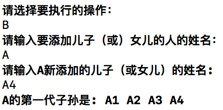

   - **解散局部家庭功能** 

     - 解散局部家庭功能流程图

     - 解散局部家庭功能核心代码

       ```c++
           void dissolveFamily(void){
               cout << "请输入要解散家庭的人的姓名：" ;
               string name;
               cin >> name;
               Node *parent = find(name, _ancestor);
               if (parent == nullptr) {
                   cout << "此人不存在～" << endl;
                   return ;
               }
               printChild(parent);
               dissolve(parent, 1);
           }
       ```

     - 解散局部家庭功能运行示例

       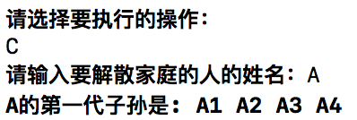

   - **更改家庭成员姓名功能**

     - 更改家庭成员姓名功能流程图

     - 更改家庭成员姓名功能核心代码

       ```c++
           //更改某位家庭成员的姓名
           void changeName(void){
               cout << "请输入要更改姓名的人的目前姓名：" << endl;
               string name;
               cin >> name;
               //找到要更改信息的家庭成员
               Node *parent = find(name, _ancestor);
               if (parent == nullptr) {
                   cout << "此人不存在～" << endl;
                   return ;
               }
               cout << "请输入更改后的姓名：" ;
               string new_name;
               cin >> new_name;
               parent->_name = new_name;
               cout << name << "已更名为" << new_name << endl;
           }
       ```

     - 更改家庭成员姓名功能运行示例

       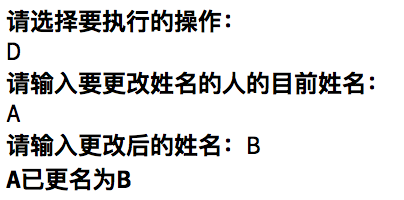

5. **鲁棒性测试**

   - **边界测试**

     1. 解散祖先的家庭，即解散根节点的家庭
        - 测试用例：输入的解散家庭的人的姓名为祖先节点的姓名

        - 预期结果：操作之后除祖先节点外其他家谱成员均被删除，只留下祖先节点。程序正常运行，仍可建立和解散家庭、添加家庭成员、修改成员姓名。

        - 测试结果：

          

       2. 解散无子女的家谱成员的家庭
         - 测试用例：输入的解散家庭的人的姓名为某无子女家谱成员的姓名

         - 预期结果：操作之后不做任何删除操作，该成员仍然存在，仍然无子女。程序正常运行，仍可建立和解散家庭、添加家庭成员、修改成员姓名。

         - 测试结果：

           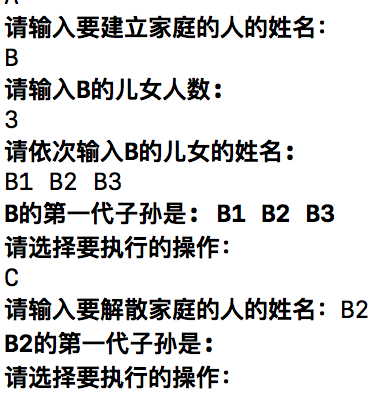
       3. 解散有多层子女的家庭
         - 测试用例：输入的解散家庭的人有多层子女

         - 预期结果：操作之后除该家属成员外其所有后代均被删除。程序正常运行，仍可建立和解散家庭、添加家庭成员、修改成员姓名。

         - 测试结果：

           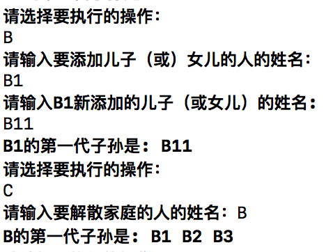

   - **非法输入测试**

     1. 完善家谱时输入的成员个数为负数
        - 测试用例：在进行完善家谱操作时输入的成员个数为负数

        - 预期结果：操作之后提示输入非法。程序正常运行，仍可建立和解散家庭、添加家庭成员、修改成员姓名。

        - 测试结果：

          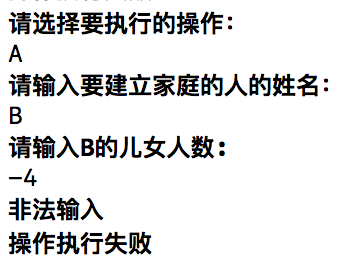

     2. 完善家谱时输入的成员不存在
        - 测试用例：在进行完善家谱操作时输入的成员不存在

        - 预期结果：操作之后系统提示该家谱成员不存在。程序正常运行不崩溃，仍可建立和解散家庭、添加家庭成员、修改成员姓名。

        - 测试结果：

          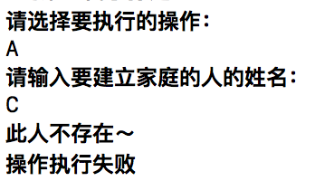

     3. 添加家庭成员时输入的成员不存在
        - 测试用例：添加家庭成员时输入的成员不存在

        - 预期结果：操作之后系统提示该家谱成员不存在。程序正常运行不崩溃，仍可建立和解散家庭、添加家庭成员、修改成员姓名。

        - 测试结果：

          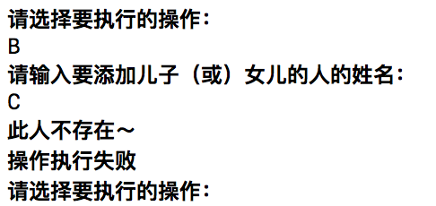

     4. 解散局部家庭时输入的成员不存在

        - 测试用例：在进行解散局部家庭操作时输入的成员不存在

        - 预期结果：操作之后系统提示该家谱成员不存在。程序正常运行不崩溃，仍可建立和解散家庭、添加家庭成员、修改成员姓名。

        - 测试结果：

          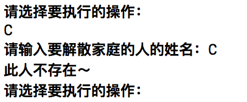

     5. 更改家庭成员姓名时输入的成员不存在

        - 测试用例：在更改家庭成员姓名操作时输入的成员不存在

        - 预期结果：操作之后系统提示该家谱成员不存在。程序正常运行不崩溃，仍可建立和解散家庭、添加家庭成员、修改成员姓名。

        - 测试结果：

          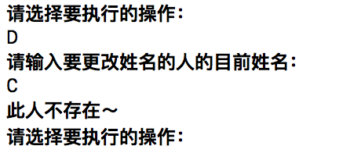


​