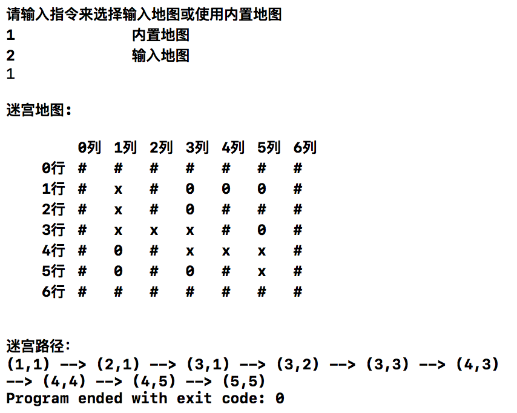
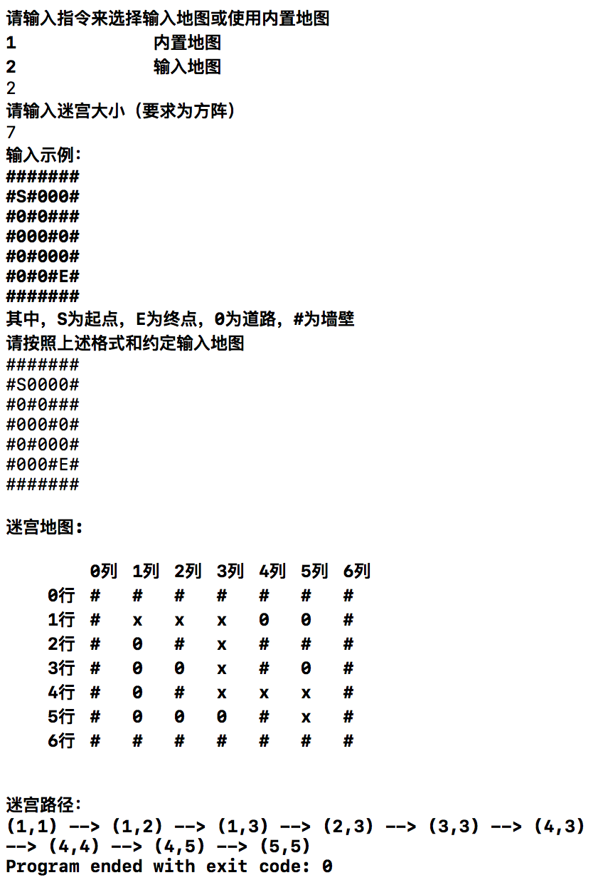
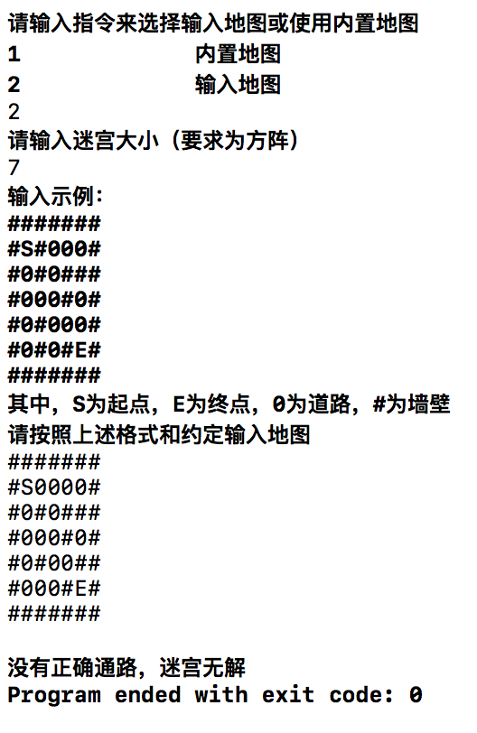

# 数据结构课程设计 项目说明文档

>  #### 迷宫问题
>
>  李坤
>
>  1553321


1. **项目介绍**

   - 给定一个迷宫，指明起点和终点，找出从起点出发到终点的有效可行路径，就是迷宫问题（maze problem）

   - 迷宫问题的求解过程可以采用回溯法即在一定的约束条件下试探地搜索前进，若前进中受阻，则及时回头纠正错误另择通路继续搜索的方法。从入口出发，按某一方向向前探索，若能走通，即某处可达，则到达新点，否则探索下一个方向；若所有的方向均没有通路，则沿原路返回前一点，换下一个方向再继续试探，直到所有可能的道路都探索到，或找到一条通路，或无路可走又返回入口点。在求解过程中，为了保证在达到某一个点后不能向前继续行走时，能正确返回前一个以便从下一个方向向前试探，则需要在试探过程中保存所能够达到的每个点的下标以及该点前进的方向，当找到出口时试探过程就结束了。

     ​

2. **整体描述**

   - 本项目完成一个迷宫求解算法，用控制台控制的方式选择使用内置地图或输入的地图完成

   - 本项目是对迷宫问题求解的简单模拟，用控制台选项的选择方式完成下列功能：使用内置迷宫地图完成迷宫问题求解；按照规定格式输入外部迷宫地图，并完成对应的迷宫问题求解。

   - 运行环境：

     exe可执行文件：带有图形驱动的windows平台

     经过测试，源码也可在Unix平台（如MacOS）上正常编译并运行

   - 代码托管平台：Github

     ​

3. **系统设计**

   - **流程设计**：迷宫问题的求解可以抽象为连通图的遍历，本设计采用深度优先搜索（DFS）加回溯法来解决此问题。它的实现不需要像广度优先算法那样记录前驱节点，但缺点是当存在多条路径时，找到的第一条路径不一定就是该问题的最优解。

   - **类设计**：

     - **路径节点类说明**：

       **功能**：该类用于存储每个路径节点基本的位置信息，只有保存坐标功能和判断两节点是否相等的功能。

       **详细描述**：

       | 成员   | 访问权限   | 详细描述    |
       | ---- | ------ | ------- |
       | x    | public | 该节点的横坐标 |
       | y    | public | 该节点的纵坐标 |

       | 方法           | 访问权限   | 详细描述            |
       | ------------ | ------ | --------------- |
       | Point        | public | 构造函数            |
       | bool equal() | public | 返回两个节点是否相等的判定结果 |

     - **迷宫类说明**：

       **功能**：该类用于存储迷宫的基本信息，并具有初始化迷宫和打印迷宫路径的功能。

       | 成员                 | 访问权限    | 详细描述         |
       | ------------------ | ------- | ------------ |
       | int _size          | private | 迷宫大小         |
       | Point _start_point | public  | 迷宫起点         |
       | Point _end_point   | public  | 迷宫终点         |
       | char **_maze       | public  | 指向迷宫的指针      |
       | int **_sign        | public  | 用于判断是否经过该点的表 |

       | 方法                | 访问权限   | 详细描述             |
       | ----------------- | ------ | ---------------- |
       | Maze()            | public | 构造函数             |
       | ～Maze()           | public | 析构函数             |
       | int initialMaze() | public | 初始化迷宫，向迷宫中存入基本数据 |
       | void printMaze()  | public | 打印迷宫             |


4. **具体实现**

   - 关键代码

   （1）在读入数据时，预先标记好起点和终点，从起点开始循环寻找路径

   ```c++
   Point current = myMaze->_start_point;   //从起点出发
   way_out.push(current);                  //将起点加入路径
   ```

   （2）在每一个循环之前增加一个判断，如果已到达终点则将最后一个路径点压入路径栈内，退出循环

   ```c++
   //到达终点时，将最后一个经过的路径点加入栈内，然后退出循环
           if (way_out.top().equal(myMaze->_end_point)){
               Point next = way_out.top();
               right_path.push(next);
               break;
           }
   ```

   （3）如果还未到达终点，则从`way_out`栈中取出当前可以探索的一个分支的入口路径节点，作为此次探索的出发点

   ```c++
           accessible(way_out.top(), myMaze);  //将某点周围可以走的路径点加入待判断栈内
           stack<Point> temp = temp_options;
           clear_way_options();                //清空待判断的路径点，等待下一次载入
           Point next = way_out.top();
           right_path.push(next);              //将上一次循环中得到的分叉口中的一个分支作为当前出发点
   ```

   （4）如果当前节点没有可以访问的新路径节点，即当前路径节点是一个死胡同，则从当前节点开始逐个将死胡同路径里的所有节点从栈中退出，直到当前访问节点变更为另一个分支的入口路径节点

   ```c++
           if(temp.size() == 0){
               Point top = way_out.top();  //回溯上一个路径点
               way_out.pop();
               right_path.pop();
               while(adjacent(top, way_out.top())){
                   //如果一条路的终点为死胡同且没有分叉口，则将这条路的路径点全部退出，直到上一分叉口
                   top = way_out.top();
                   way_out.pop();
                   right_path.pop();
                   if (way_out.empty()) {
                       cout << "没有正确通路，迷宫无解" << endl;
                       exit(0);
                   }
               }
               continue;
           }
   ```

   （5）如果当前路径节点不是死胡同，则将当前路径节点可以访问的节点位置压入`way_out`栈，在下一次循环中访问该栈顶的第一个元素，即在下一次循环中沿着当前路径继续探索

   ```c++
          while (temp.size() != 0){
               //将当前出发点的所有可能分支方向加入等待判断的路径点栈
               Point p = temp.top();
               temp.pop();
               way_out.push(p);
               myMaze->_sign[p.x][p.y] = 1;
           }
   ```

5. **运行示例**

   - 使用系统内置地图运行

     

   - 使用外部输入地图运行

     


6. **鲁棒性测试**

   - 输入的地图中包含环路

     - 测试用例：向系统中输入的地图包含环路。

     - 预期结果：算法能正确识别路径，不会在环路上转圈导致无解，也不会因为存在环路而导致路线重复，程序正常运行，不崩溃

     - 测试结果：

       

   - 输入的地图中无到出口的路径

     - 测试用例：向系统中输入的地图不包含可以到出口的通路。

     - 预期结果：算法能判断出并不存在可行路径并提供提示信息，系统正常运行不崩溃

     - 测试结果：

       