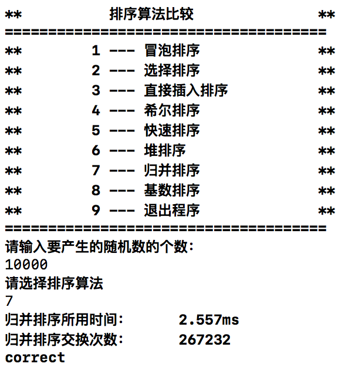

# 数据结构课程设计 项目说明文档

>  #### 八种排序算法的比较
>
>  李坤
>
>  1553321


1. **项目介绍**

   - 冒泡排序、选择排序、直接插入排序、希尔排序、快速排序、堆排序、归并排序、基数排序是常见的八种排序方式，实现各有所异，速度也有所差别。

   - 随机函数产生n个随机数，用冒泡排序、选择排序、直接插入排序、希尔排序、快速排序、堆排序、归并排序、基数排序的排序方法排序，并统计每种排序所花费的排序时间和交换次数。其中，随机数的个数由用户定义，系统产生随机数。并且显示他们的比较次数。

     ​

2. **整体描述**

   - 本项目是对八种常见排序算法的实现和对比。用控制台选项的选择方式完成下列功能：输入产生的随机数数量、选取八种不同的排序算法进行排序并进行排序时间比较。

   - 运行环境：

     exe可执行文件：带有图形驱动的windows平台

     经过测试，源码也可在Unix平台（如MacOS）上正常编译并运行

   - 代码托管平台：Github


-----------

###冒泡排序

1. **设计**

   - **算法流程**：冒泡排序的基本思想是，对相邻的元素进行两两比较，顺序相反则进行交换，这样，每一趟会将最小或最大的元素“浮”到顶端，最终达到完全有序。　　

   - **优化**

     在冒泡排序的过程中，如果某一趟执行完毕，没有做任何一次交换操作，比如数组[5,4,1,2,3]，执行了两次冒泡，也就是两次外循环之后，分别将5和4调整到最终位置[1,2,3,4,5]。此时，再执行第三次循环后，一次交换都没有做，这就说明剩下的序列已经是有序的，排序操作也就可以完成了。

2. **具体实现**

   - 用`flag`标记在一次循环中是否发生了元素交换，当没有交换时表明数串已经有序。

     ```c++
         int *sort(int *numbers, int count){
             _result = new int[count]();
             for (int i = 0; i < count; i++) {
                 _result[i] = numbers[i];
             }
             unsigned int swap_times = 0;
             clock_t start_time=clock();         //计时开始
             {
                 for (int i = 0; i < count - 1; i++) {
                     bool flag = true;
                     for (int j = 0; j < count - i - 1; j++) {
                         //当发生后一个元素小于前一个元素的情况，将后一个元素前移，与前面一个元素交换
                         if (_result[j] > _result[j+1]) {
                             int temp = _result[j + 1];
                             _result[j + 1] = _result[j];
                             _result[j] = temp;
                             swap_times++;
                             flag = false;
                         }
                     }
                     if (flag) break;
                 }
             }
             clock_t end_time=clock();   //计时结束
             cout << "冒泡排序所用时间：\t\t" 
                  << static_cast<double>(end_time-start_time)/CLOCKS_PER_SEC*1000 
                  << "ms" << endl;
             cout << "冒泡排序交换次数：\t\t" << swap_times << endl;
             return _result;
         }
     ```

   - **运行示例**

     


-----------------

### 选择排序

1. **设计**

   - **算法流程**：选择排序的基本思想是每一趟从待排序的数据元素中选择最小（或最大）的一个元素作为首元素，直到所有元素排完为止，最终达到完全有序。简单选择排序是不稳定排序。

   - **时间复杂度**：O(n^2)

   - **优化**

     在算法实现时，每一趟确定最小元素的时候会通过不断地比较交换来使得首位置为当前最小，交换是个比较耗时的操作。其实我们很容易发现，在还未完全确定当前最小元素之前，这些交换都是无意义的。我们可以通过设置一个变量min，每一次比较仅存储较小元素的数组下标，当轮循环结束之后，那这个变量存储的就是当前最小元素的下标，此时再执行交换操作即可。

2. **具体实现**

   - 每一次循环都从无序序列中找出当前序列内的最小元素，并放入有序序列的末尾，当进行了n-1次查找时，则序列已经重新排布完成。

     ```c++
         int *sort(int *numbers, int count){
             _result = new int[count]();
             for (int i = 0; i < count; i++) {
                 _result[i] = numbers[i];
             }
             unsigned int swap_times = 0;
             clock_t start_time=clock();       //计时开始
             {
               //每次从无序序列中找到一个最小元素加入有序序列的最后一个元素
                 for (int i = 0; i < count - 1; i++) {
                     for (int j = i; j < count; j++) {
                         if(_result[j] < _result[i]){
                             int temp = _result[j];
                             _result[j] = _result[i];
                             _result[i] = temp;
                             swap_times++;
                         }
                     }
                 }
             }
             clock_t end_time=clock();      //计时结束
             cout << "选择排序所用时间：\t\t" << static_cast<double>(end_time-start_time)/CLOCKS_PER_SEC*1000 << "ms" << endl;
             cout << "选择排序交换次数：\t\t" << swap_times << endl;
             return _result;
         }
     ```

   - **运行示例**

     

-----------

### 直接插入排序

1. **设计**

   - **算法流程**：直接插入排序的基本思想是，每一步将一个待排序的元素，插入到前面已经排好序的有序序列中去，直到插完所有元素为止，最终达到完全有序。　

   - **时间复杂度**：O(n^2)　

   - **优化**

     利用直接插入排序的基本思想，在一个有序序列中查找一个插入位置，使用二分查找可以减少元素比较次数，提高效率。

2. **具体实现**

   - 从第一个元素开始，从前向后搜索，当前元素之前的元素为已排序元素序列，之后为未排序元素序列。

     ```c++
         int *sort(int *numbers, int count){
             _result = new int[count]();
             for (int i = 0; i < count; i++) {
                 _result[i] = numbers[i];
             }
             unsigned int swap_times = 0;
             clock_t start_time=clock();     //计时开始
             {
                 for (int i = 1; i < count; i++) {
                     //当未排序元素的第一个元素小于已排序元素序列中的最后一个元素
                     if(_result[i - 1] > _result[i]){
                         int temp = _result[i];  //将未排序元素的第一个元素选为目标插入元素
                         int j = i - 1;
             //从已排序序列的最后一个元素开始向前搜索，将已排序元素一一向后移位，直至可以插入目标元素
                         for (; j >= 0 && _result[j] > temp; j--) {
                             _result[j + 1] = _result[j];
                             swap_times++;
                         }
                         _result[j + 1] = temp;
                         swap_times++;
                     }
                 }
             }
             clock_t end_time=clock();       //计时结束
             cout << "直接插入排序所用时间：\t\t" 
                  << static_cast<double>(end_time-start_time)/CLOCKS_PER_SEC*1000 
                  << "ms" << endl;
             cout << "直接插入排序交换次数：\t\t" << swap_times / 2 << endl;
             return _result;
         }
     ```

   - **运行示例**

     

------

### 希尔排序

1. **设计**

   - **算法流程**：希尔排序，也称递减增量排序算法。算法最开始以一定的步长进行排序，然后会继续以更小的步长进行排序，最终算法以步长为 1 进行排序。当步长为 1 时，算法变为直接插入排序，这就保证了数据一定会被全部排序。

   - **时间复杂度**： 

     希尔排序最重要的地方在于当用较小步长排序后，以前用的较大步长仍然是有序的。比如，如果一个数列以步长 5 进行了排序然后再以步长 3 进行排序，那么该数列不仅是以步长 3 有序，而且是以步长 5 有序。如果不是这样，那么算法在迭代过程中会打乱以前的顺序，那就不会以如此短的时间完成排序了。

     | 步长序列      | 最坏情况下复杂度     |
     | --------- | ------------ |
     | n/(2^i)   | O(n^2)       |
     | 2^i - 1   | O(n^(2/3))   |
     | 2^i * 3^i | O(nlog^2(n)) |

   - **算法步骤举例**：

     假设有这样一组数 {13, 14, 94, 33, 82, 25, 59, 94, 65, 23, 45, 27, 73, 25, 39, 10}，如果我们以步长为 5 开始进行排序：

     ```
     13 14 94 33 82
     25 59 94 65 23
     45 27 73 25 39
     10
     ```

     然后我们对**每列**进行排序：

     ```
     10 14 73 25 23
     13 27 94 33 39
     25 59 94 65 82
     45

     ```

     将上述四行数字，依序接在一起时我们得到：{10, 14, 73, 25, 23, 13, 27, 94, 33, 39, 25, 59, 94, 65, 82, 45}，然后再以 3 为步长：

     ```
     10 14 73
     25 23 13
     27 94 33
     39 25 59
     94 65 82
     45
     ```

     排序之后变为：

     ```
     10 14 13
     25 23 33
     27 25 59
     39 65 73
     45 94 82
     94
     ```

     最后以 1 为步长进行排序（此时就是简单的插入排序了）。

2. **具体实现**

   - 本算法采用由Knuth提出的h序列，即`gap = (gap - 1)/3`作为序列。

     ```c++
         int *sort(int *numbers, int count){
             _result = new int[count]();
             for (int i = 0; i < count; i++) {
                 _result[i] = numbers[i];
             }
             unsigned int swap_times = 0;
             clock_t start_time=clock();     //计时开始
             {
                 int gap = 1;
                 //以gap = 1的最终值进行反推，求出gap增量序列的最大值
                 while (gap <= count / 3) {
                     gap = gap * 3 + 1;
                 }
                 while (gap > 0) {
                     for (int i = gap; i < count; i++) {
                         //按gap将无序序列分为count/gap个组，对每个组进行插入排序
                         if(_result[i - gap] > _result[i]){
                             //将此时的较小值保存
                             int temp = _result[i];
                             int j = i - gap;
                             //从较大值开始，将其一个一个后移，直到找到合适的插入位置
                             for (; j >= 0 && _result[j] > temp; j -= gap) {
                                 _result[j + gap] = _result[j];
                                 swap_times++;
                             }
                             //当前值比保存值还小时，则证明上一个位置是正确位置，将之前保存的值插入
                             _result[j + gap] = temp;
                             swap_times++;
                         }
                     }
                     //得到下一个gap序列值
                     gap = (gap - 1) / 3;
                 }
             }
             clock_t end_time=clock();       //计时结束
             cout << "希尔插入排序所用时间：\t\t" << static_cast<double>(end_time-start_time)/CLOCKS_PER_SEC*1000 << "ms" << endl;
             cout << "希尔插入排序交换次数：\t\t" << swap_times / 2 << endl;
             return _result;
         }
     ```

   - **运行示例**

     


------

### 快速排序

1. **设计**

   - **算法流程**：快速排序的基本思想是：通过一趟排序将要排序的数据分割成独立的两部分，其中一部分的所有数据都比另外一部分的所有数据都要小，然后再按此方法对这两部分数据分别进行快速排序，整个排序过程可以递归进行，以此达到整个数据变成有序序列。

   - **时间复杂度**：O(n^2)　 

   - **优化**

     1. 在快排的过程中，每一次我们要取一个元素作为枢纽值，以这个数字来将序列划分为两部分。在此我们采用三数取中法，也就是取左端、中间、右端三个数，然后进行排序，将中间数作为枢纽值。

        

     2. 根据枢纽值进行分割

        

        

2. **具体实现**

   - 从第一个元素开始，从前向后搜索，当前元素之前的元素为已排序元素序列，之后为未排序元素序列。

     ```c++
         void quickSort(int *target, int left_index, int right_index){
             //当左右索引重合时，递归结束，序列已经有序
             if(left_index < right_index){
                 int key_value = target[left_index];     //主元
                 int low_index = left_index;             //左起点
                 int high_index = right_index;           //右起点
                 //此时主元素所在的位置为空位
                 while (low_index < high_index) {
                     //从右边开始搜索，直到发现比主元小的元素
                     while (low_index < high_index && key_value < target[high_index]) {
                         high_index--;
                     }
                     //将找到的较小元素放入到空出来的位置，此时其原位置为空，可被放置一个较大元素
                     target[low_index] = target[high_index];
                     _swap_times++;
                     //从左边继续搜索，直到发现比主元大的元素
                     while (low_index < high_index && key_value > target[low_index]) {
                         low_index++;
                     }
                     //将找到的较大元素放入刚刚空出来的位置，此时其原位置为空，可被放置一个较小元素
                     target[high_index] = target[low_index];
                     _swap_times++;
                 }
                 //将主元素填入交换完成后剩下的空位，此时主元素左边的所有元素均小于主元素，右边均大于主元素
                 target[low_index] = key_value;
                 _swap_times++;
                 //分别对左右序列进行递归
                 quickSort(target, left_index, low_index - 1);
                 quickSort(target, low_index + 1, right_index);
             }
         }
         
         int *sort(int *numbers, int count){
             _result = new int[count]();
             for (int i = 0; i < count; i++) {
                 _result[i] = numbers[i];
             }
             clock_t start_time=clock();     //开始计时
             {
                 //调用递归函数进行快速排序，初始下待排序数组左下标为0，右下标为数组元素个数-1
                 quickSort(_result, 0, count - 1);
             }
             clock_t end_time=clock();       //计时结束
             cout << "快速排序所用时间：\t\t" 
                  << static_cast<double>(end_time-start_time)/CLOCKS_PER_SEC*1000 
                  << "ms" << endl;
             cout << "快速排序交换次数：\t\t" << _swap_times << endl;
             return _result;
         }
     ```

   - **运行示例**

     


------

### 堆排序

1. **设计**

   - **算法流程**：堆排序的基本思想是：将待排序序列构造成一个大顶堆，此时，整个序列的最大值就是堆顶的根节点。将其与末尾元素进行交换，此时末尾就为最大值。然后将剩余n-1个元素重新构造成一个堆，这样会得到n个元素的次小值。如此反复执行，便能得到一个有序序列了。堆排序是不稳定排序。

   - **堆**：是具有以下性质的完全二叉树：每个结点的值都大于或等于其左右孩子结点的值，称为大顶堆；或者每个结点的值都小于或等于其左右孩子结点的值，称为小顶堆。如下图：

     

     **大顶堆：arr[i] >= arr[2i+1] && arr[i] >= arr[2i+2]  **

     **小顶堆：arr[i] <= arr[2i+1] && arr[i] <= arr[2i+2]  **

     对堆中的结点按层进行编号，将这种逻辑结构映射到数组中如下图所示：

     

   - **时间复杂度**：O(nlogn) 

   - **步骤一** 构造初始堆。将给定无序序列构造成一个大顶堆（一般升序采用大顶堆，降序采用小顶堆)。

     - 假设给定无序序列结构如下

       

     - 此时从最后一个非叶子结点开始（叶结点自然不用调整，第一个非叶子结点 arr.length/2-1=5/2-1=1，也就是下面的6结点），从左至右，从下至上进行调整。

       

     - 找到第二个非叶节点4，由于[4,9,8]中9元素最大，4和9交换。

       

     - 这时，交换导致了子根[4,5,6]结构混乱，继续调整，[4,5,6]中6最大，交换4和6。

       

     - 此时，就将一个无需序列构造成了一个大顶堆。

   - **步骤二** 将堆顶元素与末尾元素进行交换，使末尾元素最大。然后继续调整堆，再将堆顶元素与末尾元素交换，得到第二大元素。如此反复进行交换、重建、交换。

     - 将堆顶元素9和末尾元素4进行交换

       

     - 重新调整结构，使其继续满足堆定义

       

     - 再将堆顶元素8与末尾元素5进行交换，得到第二大元素8

       

     - 后续过程，继续进行调整，交换，如此反复进行，最终使得整个序列有序

       


2. **具体实现**

- 将无需序列构建成一个堆，根据升序降序需求选择大顶堆或小顶堆

  ```c++
      void adjustHeap(int *heap, int start, int end){
          int temp = heap[start];//start为堆顶部
          for (int i = 2*start + 1; i <= end; i = i * 2 + 1) {
              //i为左节点, i+1为右节点
              //将i调整为指向左、右节点中较大节点的索引
              if(heap[i] < heap[i + 1] && i + 1 <= end){
                  i++;
              }
              //如果左右节点中的较大值都比父节点小，则无需调整
              if(heap[i] < temp){
                  break;
              }
              //将左右节点中较大的值与父节点的值交换
              //此次调整可能会造成较大值节点所在的子树不平衡，不再满足大顶堆的性质
              //以较大值节点为下一次循环的父节点，继续自上而下调整
              heap[start] = heap[i];
              start = i;
              _swap_times++;
          }
          //将调整结束后原顶部元素放置到适当的位置
          heap[start] = temp;
          _swap_times++;
      }
  ```

- 将堆顶元素与末尾元素交换，将最大元素"沉"到数组末端

- 重新调整结构，使其满足堆定义，然后继续交换堆顶元素与当前末尾元素，反复执行调整+交换步骤，直到整个序列有序

  ```c++
      void heapSort(int *heap, int count)
      {
          //从第倒数第一个非叶子节点开始，自下而上调整堆使其成为大顶堆
          for (int i = (count - 1) / 2; i >= 0; i--) {
              adjustHeap(heap, i, count - 1);
          }
          //每次取出堆顶端的元素，即取出最大元素放入堆的末尾，之后调整时不再对末尾有序元素进行调整
          //进行n-1次取值和调整后，存放堆的数组从0开始即位一个有序数组
          for (int i = count - 1; i >= 0; i--) {
              //交换堆顶值与末尾值
              int temp = heap[i];
              heap[i] = heap[0];
              heap[0] = temp;
              _swap_times++;
              //交换完成后调整堆使其依然保持为大顶堆
              adjustHeap(heap, 0, i - 1);
          }
      }
  ```

- **运行示例**

  


------

### 归并排序

1. **设计**

   - **算法流程**：归并排序（MERGE-SORT）的基本思想是：利用**归并**的思想实现的排序方法，采用经典的**分治**（divide-and-conquer）策略（分治法将问题**分**(divide)成一些小的问题然后递归求解，而**治(conquer)**的阶段则将分的阶段得到的各答案"修补"在一起，即分而治之)。

   - 本算法的归并排序采用递归去实现。**“分”**这一阶段可以理解为就是递归拆分子序列的过程，递归深度为log2n。

     

   - **“治”**这一阶段将两个已经有序的子序列合并成一个有序序列如将[4,5,7,8]和[1,2,3,6]两个已经有序的子序列，合并为最终序列[1,2,3,4,5,6,7,8]。

     

     

   - **时间复杂度**：O(nlogn) 

2. **具体实现**

- 将当前序列先不断从中间开始划分为更小的序列并进行排序，然后进行将已有的有序序列合并。

  ```c++
      void msort(int *numbers, int start, int end){
          if(start < end){
              int mid = (start + end) / 2;
              //对左边序列进行排序
              msort(numbers, start, mid);
              //对右边序列进行排序
              msort(numbers, mid + 1, end);
              //将左右两边的有序序列合并为一个有序序列
              merge(numbers, start, mid, end, _buffer);
          }
      }

      void merge(int* input, int start, int mid, int end, int* output)
      {
          int first_index = start;    //第一个待合并序列的起点
          int second_index = mid + 1; //第二个待合并序列的起点
          int out_index = start;      //合并结果的有序序列的起点
          while (first_index <= mid && second_index <= end) {
              //如果第一个序列的值小于第二个序列的值
              if(input[first_index] < input[second_index]){
                  //将第一个序列的值插入有序序列
                  output[out_index++] = input[first_index++];
                  _swap_times++;
              }else{//如果第一个序列的值大于第二个序列的值
                  output[out_index++] = input[second_index++];
                  //将第二个序列的值插入有序序列
                  _swap_times++;
              }
          }
          //如果两个序列中已经有一个序列插入完成
          //将第一个序列剩余的元素直接插入有序序列
          while (first_index <= mid) {
              output[out_index++] = input[first_index++];
              _swap_times++;
          }
          //将第二个序列剩余的元素直接插入有序序列
          while (second_index <= end) {
              output[out_index++] = input[second_index++];
              _swap_times++;
          }
          //将合并结果放回原数组中
          for (int i = start; i <= end; i++) {
              input[i] = output[i];
              _swap_times++;
          }
      }

  ```

- **运行示例**

  


------

### 基数排序

1. **设计**

   - **算法流程**：基数排序的基本思想是：将所有待比较数值（正整数）统一为同样的数位长度，数位较短的数前面补零。然后，从最低位开始，依次进行一次排序。这样从最低位排序一直到最高位排序完成以后，数列就变成一个有序序列。

   - **排序方式**：基数排序的方式可以采用 LSD（Least significant digital）或 MSD（Most significant digital），LSD 的排序方式由键值的最右边开始，而 MSD 则相反，由键值的最左边开始。

   - **流程举例**：

     - 设有一个初始序列为: R {50, 123, 543, 187, 49, 30, 0, 2, 11, 100}。

     - 任何一个阿拉伯数，它的各个位数上的基数都是以 0~9 来表示的，所以不妨把 0~9 视为 10 个桶。

     - 先根据序列的个位数的数字来进行分类，将其分到指定的桶中。例如：R[0] = 50，个位数上是 0，将这个数存入编号为 0 的桶中。

       

     - 分类后从各个桶中，将这些数按照从编号 0 到编号 9 的顺序依次将所有数取出来。这时，得到的序列就是个位数上呈递增趋势的序列。按照个位数排序： {50, 30, 0, 100, 11, 2, 123, 543, 187, 49}。

     - 接下来，可以对十位数、百位数也按照这种方法进行排序，最后就能得到排序完成的序列。

   - **时间复杂度**：O(Kn)，K为最大的数字位数

   - **优化**：在算法的原理中，是以一张二维数组的表来存储这些无序的元素。使用二维数组有一个很明显的不足就是二维数组太过稀疏。存在一种可以压缩空间，且时间复杂度并没有偏离得太厉害的方法：设计两个辅助数组，一个是` count[]`，一个是 `bucket[]`。`count` 用于记录在某个桶中的最后一个元素的下标，然后再把原数组中的元素计算一下它应该属于哪个“桶”，并修改相应位置的 `count `值。直到最大数的最高位也被添加到桶中，或者说，当所有的元素都被被在第 0 个桶中，基数排序就结束了。 

2. **具体实现**

   -  定义一个辅助方法，用于从`bucket`中第i个数字取出其第bit位数字

     ```c++
     //获取桶中某个数字第bit位的数字，如302第0位的数字为2
     int getBitNumber(int *bucket, int index, int bit){
         int n = bucket[index] / (int)pow(10, bit) - (bucket[index]/(int)pow(10, bit + 1)) * 10;
         return n;
     }
     ```

   -  每一次递归，按照第bit位数字进行排序，当每个数字的第bit位数均为0时，排序结束，序列有序。

     ```c++
         int* radixSort(int *target, int bit, int total_number){
             //用来标记第bit位数为0～9的数字在有序序列中的最后一个数字的索引
             int* count = new int[10]();
             //用来存放所有数字
             int* bucket = new int[total_number]();
             //用来计算bit位数字为0的数字的个数，当其等于数字总个数时序列有序
             int number_of_zeros = 0;
             //计算第bit位数为0～9的数字在有序序列中的个数
             for (int i = 0; i < total_number; i++) {
                 count[getBitNumber(target, i, bit)]++;
             }
             
             number_of_zeros = count[0];
             //计算第bit位数为0～9的数字在有序序列bucket中的最后一个数字的索引（得到结果为索引值+1）
             //例如假设末尾为0的数字有两个，则得到的count[0] = 2
             //此时bucket中末尾为0的最后一个数字索引为2 - 1 = 1
             for (int i = 1; i < 10; i++) {
                 count[i] += count[i - 1];
             }
             //从最后一个数字开始，按照bit位进行排序
             for (int i = total_number - 1; i >= 0; i--) {
                 //获取第i个数字的bit位数字
                 int temp_bit = getBitNumber(target, i, bit);
                 //将第i个数字放入辅助数组bucket内，buket是按bit位元素排序后的序列
                 bucket[count[temp_bit] - 1] = target[i];
                 _swap_times++;
                 //bit位末尾数字为temp_bit的数字已经填入一个，待填入数字的数目-1
                 count[temp_bit]--;
             }
             //如果bit为0的数字等于所有的数字个数，则bucket序列有序
             if(number_of_zeros == total_number){
                 return bucket;
             }else{
                 return radixSort(bucket, bit + 1, total_number);
             }
         }
     ```

   - 运行示例

     

## 算法正确性检验

- 定义了一个辅助方法，用于检验每次排序后算法给出的数组是否有序，正确时输出`correct`

  ```c++
  bool check(int total, int* target){
      for (int i = 0; i < total - 1; i++) {
          if(target[i] > target[i + 1]){
              return false;
          }
      }
      return true;
  }
  ```


## 算法速度比较

分三个数量级，分别取生成的随机数为**100**个、**10000**个、**100000**个，进行算法比较

- 随机数数量为**100**

  

- 随机数数量为**10000**

  

- 随机数数量为**100000**

  

