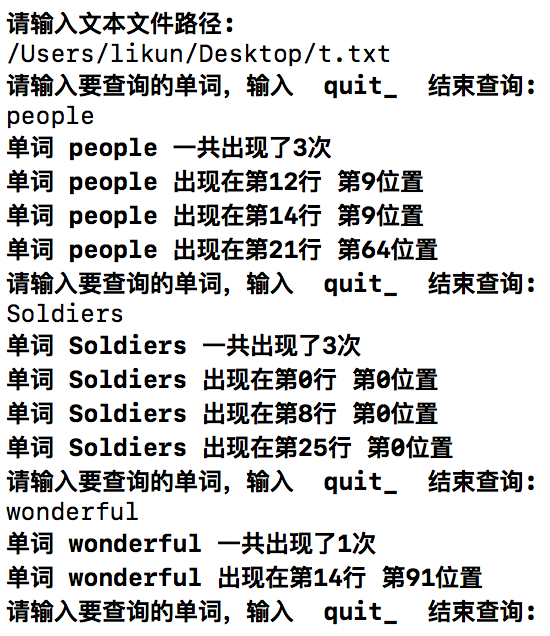
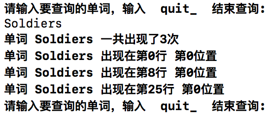
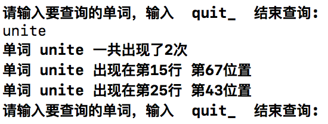

# 数据结构课程设计 项目说明文档

>  #### 单词检索统计系统
>
>  李坤
>
>  1553321


1. **项目介绍**

   - 给定一个文本文件，要求统计给定单词在文本中出现的总次数，并检索输出某个单词出现在文本中的行号、在该行中出现的次数以及位置。


   - 本项目的设计要求可以分为三个部分实现：其一，建立一个文本文件，文件名由用户用键盘输入；其二，给定单词计数，输入一个不含空格的单词，统计输出该单词在文本中的出现次数；其三，检索给定单词，输入一个单词，检索并输出该单词所在的行号、该行中出现的次数以及在该行中的相应位置。

     ​

2. **整体描述**

   - 本项目是对单词检索系统的简单模拟，用控制台选项的选择方式完成下列功能：输入需要检索的文件地址，完成文件的读取；待文件读取完成后，输入需要检索的单词，系统给出其出现次数和出现位置。

   - 运行环境：

     exe可执行文件：带有图形驱动的windows平台

     经过测试，源码也可在Unix平台（如MacOS）上正常编译并运行

   - 代码托管平台：Github

     ​

3. **系统设计**

   - **数据结构**：考虑到需要对每一行句子进行搜索，所以采用`vector`做数据容器，`string`作为数据类型来存储每一行的句子

   - **字符串匹配算法**：

     - 综合考虑实现的方便程度和算法运行效率，采用`Sunday`算法作为字符串的匹配算法。`Sunday`算法是Daniel M.Sunday于1990年提出的一种比BM算法搜索速度更快的算法。其核心思想是：在匹配过程中，模式串并不被要求一定要按从左向右进行比较还是从右向左进行比较，它在发现不匹配时，算法能跳过尽可能多的字符以进行下一步的匹配，从而提高了匹配效率。在一定程度上比`KMP`算法和`BM`算法更优。但是该算法最坏情况下的时间复杂度为O(m*n)。 

     - **查找过程举例**:

       1. 
       第一次匹配过程中，从搜索词的首字母开始从左往右匹配，字符串中的“H”与 “E”发现不匹配，就查找字符串中右端对齐的字符的下一位，也就是“ ”(空格)，**原则：如果该字符没有在匹配串中出现则直接跳过，即移动步长= 匹配串长度+1；否则，同BM算法一样其移动步长=匹配串中最右端的该字符到末尾的距离+1。**

       2. 
       发现字符串与搜索词右端对齐的下一位字符即“ ”(空格)并不在搜索词中出现过，就移动步长为8位，如图所示。

       3. 
       继续从左往右开始匹配字符，发现字符串中的“A”与搜索词中的“E”并不匹配，就查看右端对齐的下一个字符“E”，发现“E”在搜索词中，并且有两个，按照suanday原则就选择搜索词中最右的字符“E”，这样可以保证在右端对齐的下以一个字符在搜索词中存在的情况下，移动步长最小，保证这种情况下不失匹配机会。 
       移动后，从左往右开始匹配，发现是“ ”(空格)与搜索词的首字母“E”不匹配，继续按上述匹配原则进行移动。 
       4. 
          
         字符串与搜索词最右端的下一个字符是“ ”(空格)，依照上述原则，在搜索词中并不存在“ ”(空格)，移动的步长为8，最终结果如图所示。找到匹配。

4. **具体实现**

   - 利用一个辅助数组来保存目标字符串中各个字母的出现位置，由于在`Sunday`算法中，出现不匹配的情况时是从目标字符串的最后一个字符从后开始向前寻找匹配的字符的，所以在目标字符串中出现两个相同字符时，记录的为最后一个字母出现的位置

     ```c++
     int _locate[256];       //辅助数组，用于统计单词中字母出现的位置，如果有两个相同字母，则记录最后一个字母出现的位置
     int _total_count = 0;   //某单词出现的总次数
     ```

   -  辅助函数，用来将在每次开始匹配流程前清空辅助数组并保存目标字符串中各个字母的出现位置

     ```c++
     void locate_next_char(string pattern){
         int m = pattern.size();
         for (int i = 0; i < 256; i++) {
             _locate[i] = -1;
         }
         for (int i = 0; i < m; i++) {
             _locate[pattern[i]] = i;    //以第i个字符为索引，指向目标字符串中第i个字符最后出现的位置
         }
     }
     ```

   - 在一个搜索函数中完成两个功能，通过`mode`标志来决定是否仅仅统计目标字符串出现次数或者在匹配时打印出目标字符串的出现位置。当搜索失败时，返回-1。

     ```c++
     int search(string pattern, string target, int mode, int row)
     {
         //mode = 1,仅统计单词出现的次数，mode = 2，输出单词所在行号，出现次数以及相应位置
         int m = pattern.size();
         int n = target.size();
         locate_next_char(pattern);
         
         //...................................
         
         return -1;
     } 
     ```

   -  对单行文本进行字符串匹配。先从头向后匹配，如果出现不匹配字符，则从目标串的下一个待匹配位置，从后向前从模式串里面寻找是否有匹配字符。如果有，将该字符对齐，重新从模式串头部开始对字符串进行匹配。如果没有，将模式串首字符与目标字符串下一个待匹配位置对齐，重新从模式串头部开始对字符串进行匹配。

     ```c++
         for (int i = 0; i < n - m + 1; ) {
             //i为主串中指向当前判定字符的索引
             //j为一次判定流程中指向已正确匹配的字符串末尾的索引
             int j = i;
             int k = 0;
             
             for (; k < m && j < n && pattern[k] == target[j]; k++, j++) ;
             
             if (k == m) {
                 //匹配成功
                 if (mode == 1) {
                     _total_count ++;
                 }
                 if(mode == 2){
                     cout << "单词 " << pattern << " 出现在第" << row << "行 第" << i << "位置"<< endl;
                 }
                 //如果匹配结束后仍然未达到该行的末尾
                 if(i + m < n){
                     //索引向后移动直至目标字符串中下一个查找的字符与模式串中出现的最后一个相同字符对齐
                     //如果模式串中未出现相同字符，则将索引直接后移模式串长度+1
                     i += m - _locate[target[i + m]];
                 }else{
                     return -1;
                 }
             }else{
                 //如果匹配失败
                 //索引向后移动直至目标字符串中下一个查找的字符与模式串中出现的最后一个相同字符对齐
                 //如果模式串中未出现相同字符，则将索引直接后移模式串长度+1
                 if(i + m < n){
                     i += m - _locate[target[i + m]];
                 }else{
                     return -1;
                 }
             }
         }
     ```

5. **运行示例**

   

6. **鲁棒性测试**

   1. 输入的文本地址路径错误
      - 测试用例：向程序中输入错误的文本地址

      - 预期结果：操作后系统能正常提示无法找到对应的文本文件，程序正常运行不崩溃

      - 测试结果：

        

     2. 查询不存在的单词
       - 测试用例：查询单词时向系统中输入文本中不存在的单词

       - 预期结果：操作之后系查找功能能正常运行，显示查找结果为0，系统不崩溃。

       - 测试结果：

         
     3. 查询单词位于句子开头
       - 测试用例：查询单词时向系统中输入的单词位于文本中某个句子的开头

       - 预期结果：操作之后系查找功能能正常运行，正确显示查找结果，没有漏掉任何单词，系统不崩溃。

       - 测试结果：

         
     4. 查询单词位于句子末尾
       - 测试用例：查询单词时向系统中输入的单词位于文本中某个句子的末尾

       - 预期结果：操作之后系查找功能能正常运行，正确显示查找结果，没有漏掉任何单词，系统不崩溃。

       - 测试结果：

         


####附：测试文本

```
Soldiers!
 Don't give yourselves to brutes - men who despise you and enslave you - who regiment your lives - tell you what to do - what to think and what to feel! 
Who drill you - diet you - treat you like cattle, use you as cannon fodder. 
Don't give yourselves to these unnatural men - machine men with machine minds and machine hearts! 
You are not machines! 
You are not cattle! You are men! You have the love of humanity in your hearts. 
You don't hate, only the unloved hate - the unloved and the unnatural!

Soldiers! 
Don't fight for slavery! 
Fight for liberty! In the seventeenth chapter of St Luke, it is written the kingdom of God is within man not one man nor a group of men, but in all men! 
In you! 
You, the people, have the power - the power to create machines. 
The power to create happiness! 
You, the people, have the power to make this life free and beautiful - to make this life a wonderful adventure. 
Then in the name of democracy - let us use that power - let us all unite. 
Let us fight for a new world - a decent world that will give men a chance to work - that will give youth a future and old age a security.

By the promise of these things, brutes have risen to power. 
But they lie! 
They do not fulfil that promise. 
They never will! Dictators free themselves but they enslave the people. 
Now let us fight to fulfil that promise! 
Let us fight to free the world - to do away with national barriers - to do away with greed, with hate and intolerance. 
Let us fight for a world of reason - a world where science and progress will lead to all men's happiness. 
Soldiers, in the name of democracy, let us unite!
```

